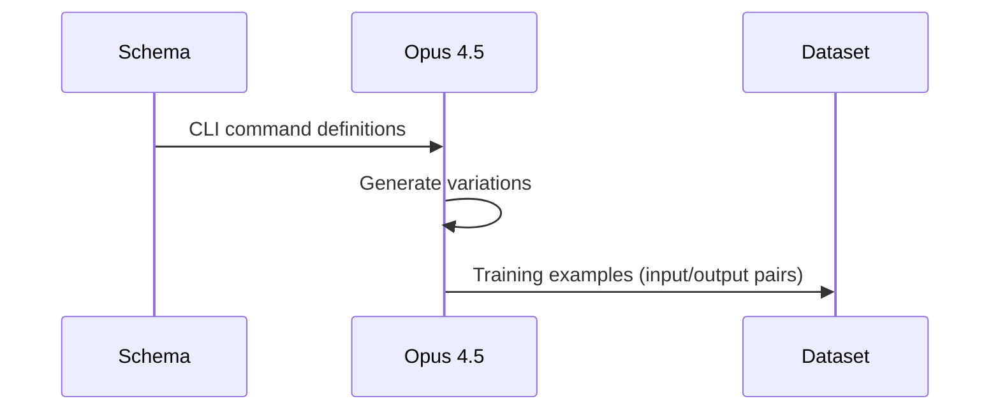
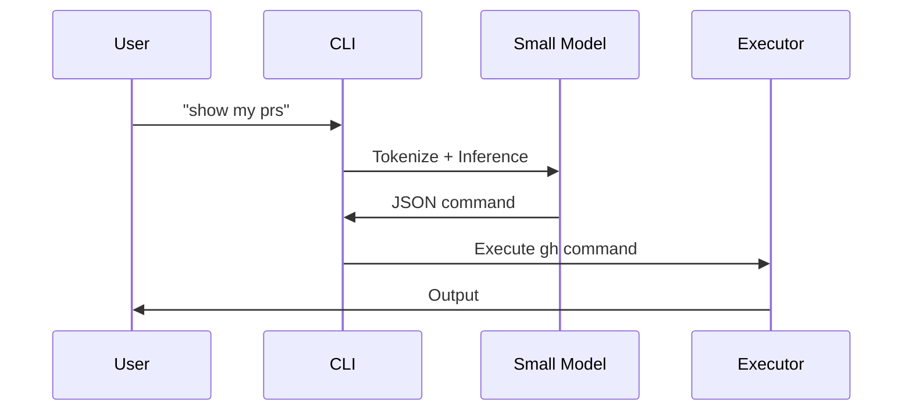

# Clitron Agents

This document describes the AI agents and models used in the clitron project.

## Specs

`specs/` contains feature specifications. New code should comply with these or propose changes.

| File | Description |
|------|-------------|
| [architecture.md](specs/architecture.md) | System architecture and component design for natural language CLI interpretation |
| [hgh-cli.md](specs/hgh-cli.md) | Specification for `hgh` demo CLI that wraps GitHub's `gh` with natural language |
| [model.md](specs/model.md) | Model selection criteria, candidates, and requirements for the small LLM |
| [rust-lib.md](specs/rust-lib.md) | Rust library (`clitron` crate) structure and public API |
| [training.md](specs/training.md) | Training pipeline: data generation, SFT, DPO, quantization, and named trainings |

## Cloud Agent Start

Pre-configured environment variables:
- `OPENAI_API_KEY`
- `ANTHROPIC_API_KEY`
- `GITHUB_TOKEN`

## Pre-PR Checklist

- [ ] Run `just ci` (format, lint, test)
- [ ] Address all PR comments
- [ ] CI should be 100% green
- [ ] Update specs if behavior changes

## Commits Convention

Follow [Conventional Commits](https://www.conventionalcommits.org/): `type(scope): description`

**Types:** `feat`, `fix`, `docs`, `refactor`, `test`, `chore`

**Examples:**
```
feat(clitron): add confidence threshold configuration
fix(hgh): handle empty input gracefully
docs(specs): update training pipeline diagram
refactor(training): simplify data generation loop
test(clitron): add edge cases for ambiguous commands
chore(deps): update transformers to 4.40
```

## Overview

Clitron uses a multi-agent approach:
1. **Large LLM** (training time): Generates training data and evaluates outputs
2. **Small LLM** (runtime): Interprets user commands in production

## Training-Time Agents

### Data Generation Agent

**Model**: Claude Opus 4.5 (or GPT-5.2)

**Purpose**: Generate diverse, high-quality training examples from CLI schemas.

**Responsibilities**:
- Parse command schemas and understand CLI structure
- Generate natural language variations for each command
- Create edge cases and ambiguous inputs
- Validate generated examples for correctness

**Prompt Template**:
```
You are generating training data for a CLI command interpreter.
Given this schema: {schema}
Generate {n} diverse natural language inputs with their structured outputs.
```

**Quality Requirements**:
- All outputs must be valid JSON
- Commands must exist in the schema
- Arguments must match schema types
- Cover diverse phrasings and formality levels

### Preference Evaluation Agent

**Model**: Claude Opus 4.5

**Purpose**: Generate preference data for DPO training by comparing model outputs.

**Responsibilities**:
- Evaluate small model outputs against ideal outputs
- Rank outputs by quality and correctness
- Identify systematic errors for improvement

**Output Format**:
```json
{
  "prompt": "show my prs",
  "chosen": {"command": "pr", "subcommand": "list", "args": {"author": "@me"}},
  "rejected": {"command": "pr", "subcommand": "list", "args": {}}
}
```

## Runtime Agent

### Command Interpreter Agent

**Model**: Fine-tuned Llama 3.2 1B Instruct (or similar small model)

**Format**: GGUF (quantized to Q4_K_M)

**Purpose**: Real-time interpretation of natural language CLI commands.

**Characteristics**:
- Size: < 500MB quantized
- Latency: < 100ms inference
- Memory: < 512MB runtime
- Accuracy: > 95% on common commands

**Input Format**:
```
<|system|>
You are a CLI interpreter. Output only valid JSON.
Schema: {schema_summary}
<|user|>
{user_input}
<|assistant|>
```

**Output Format**:
```json
{
  "command": "pr",
  "subcommand": "list",
  "args": {"state": "open", "author": "@me"},
  "flags": ["web"],
  "confidence": 0.95
}
```

**Confidence Thresholds**:
- `>= 0.9`: Execute immediately
- `0.7 - 0.9`: Execute with explanation
- `0.5 - 0.7`: Ask for confirmation
- `< 0.5`: Show suggestions, don't execute

## Model Selection Criteria

### Why Small Models?

1. **Latency**: CLI tools must respond instantly (<100ms)
2. **Distribution**: Can be bundled with the CLI binary
3. **Privacy**: No API calls, runs fully offline
4. **Cost**: No per-query API costs

### Model Candidates

| Model | Parameters | Quantized | Pros | Cons |
|-------|------------|-----------|------|------|
| Llama 3.2 1B | 1B | ~500MB | Best balance | Slightly larger |
| Qwen2.5 0.5B | 0.5B | ~300MB | Smallest | Less capable |
| SmolLM2 1.7B | 1.7B | ~800MB | Edge-optimized | Larger |
| Gemma 2 2B | 2B | ~1GB | Good quality | Large |

**Recommended**: Llama 3.2 1B Instruct with Q4_K_M quantization.

## Training Pipeline

```
┌──────────────────────────────────────────────────────────────────┐
│                         Training Pipeline                         │
├──────────────────────────────────────────────────────────────────┤
│                                                                   │
│  ┌─────────────┐    ┌─────────────┐    ┌─────────────────────┐   │
│  │   Schema    │ →  │  Opus 4.5   │ →  │  Training Dataset   │   │
│  │   (YAML)    │    │  (Generate) │    │  (10k+ examples)    │   │
│  └─────────────┘    └─────────────┘    └─────────────────────┘   │
│                                                   │               │
│                                                   ▼               │
│  ┌─────────────┐    ┌─────────────┐    ┌─────────────────────┐   │
│  │  Quantized  │ ←  │    DPO      │ ←  │   SFT Training      │   │
│  │   Model     │    │  Training   │    │   (Llama 3.2 1B)    │   │
│  └─────────────┘    └─────────────┘    └─────────────────────┘   │
│        │                                                          │
│        ▼                                                          │
│  ┌─────────────────────────────────────────────────────────────┐ │
│  │                    Production Deployment                     │ │
│  │              Embedded in CLI or downloaded once              │ │
│  └─────────────────────────────────────────────────────────────┘ │
│                                                                   │
└──────────────────────────────────────────────────────────────────┘
```

## Agent Communication

### Schema → Training Data



### Runtime Interpretation



## Evaluation Metrics

### Training Metrics

| Metric | Target | Description |
|--------|--------|-------------|
| Train Loss | < 0.5 | Cross-entropy loss |
| Val Loss | < 0.6 | Validation loss |
| Perplexity | < 5 | Model perplexity |

### Runtime Metrics

| Metric | Target | Description |
|--------|--------|-------------|
| Exact Match | > 90% | Perfect JSON match |
| Command Accuracy | > 98% | Correct command identified |
| Arg Accuracy | > 95% | Correct arguments |
| Latency P50 | < 50ms | Median latency |
| Latency P99 | < 150ms | 99th percentile |

## Development Agents

### For Contributors

When developing clitron, you can use AI assistants for:

1. **Schema Design**: Help design command schemas
2. **Test Generation**: Generate test cases for interpreters
3. **Documentation**: Generate and update docs
4. **Code Review**: Review PRs for correctness

### Recommended Prompts

**Schema Design**:
```
Design a clitron schema for [CLI name]. Include:
- All major commands and subcommands
- Natural language aliases
- Argument types and defaults
- Example natural language inputs
```

**Test Generation**:
```
Generate test cases for the clitron interpreter with schema:
{schema}

Include:
- Happy path cases
- Edge cases
- Ambiguous inputs
- Invalid inputs
```

## Security Considerations

1. **No Code Execution**: Model output is parsed as JSON, never executed as code
2. **Schema Validation**: All commands validated against schema before execution
3. **Confidence Gates**: Low-confidence interpretations require confirmation
4. **Audit Logging**: All interpretations can be logged for review
5. **Offline Operation**: No data sent to external APIs in production

## Future Improvements

1. **Context Awareness**: Use conversation history for multi-turn commands
2. **Personalization**: Learn user preferences over time
3. **Multi-CLI Support**: Train single model for multiple CLIs
4. **Voice Integration**: Support voice input via speech-to-text
